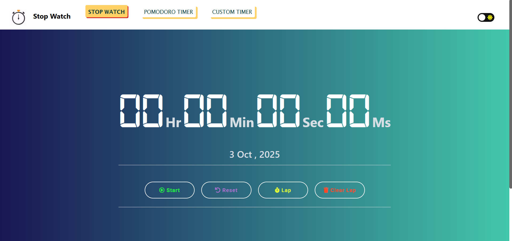
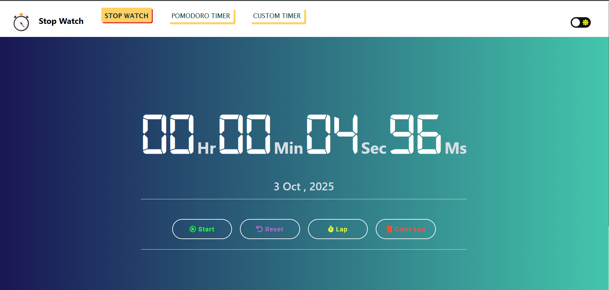
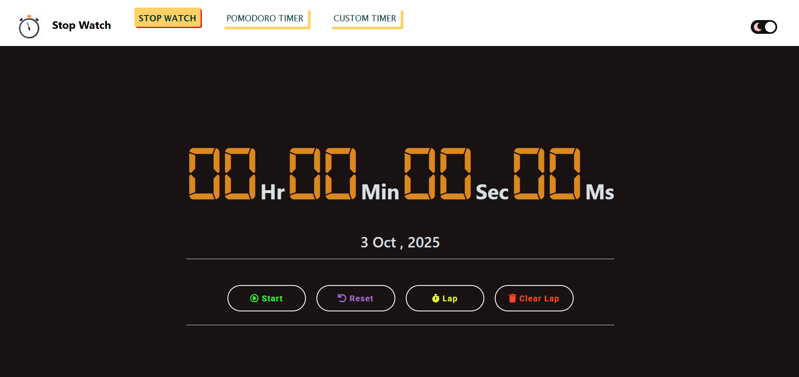
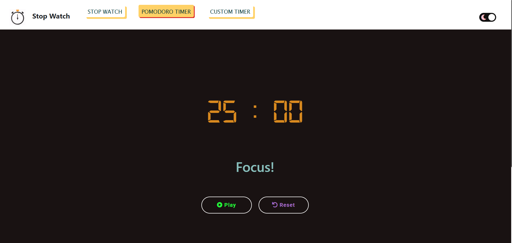
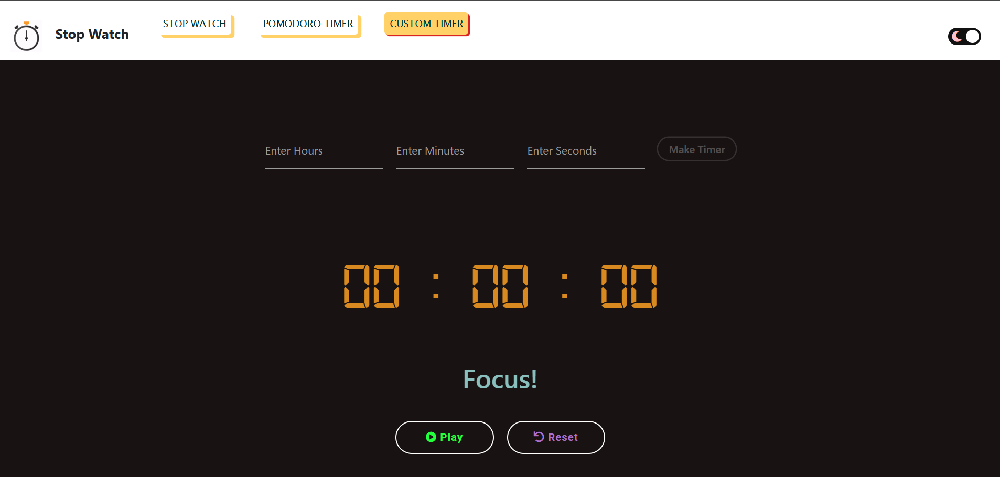

# Enhanced Stopwatch & Timer Suite 🕐

[](https://github.com/avinash201199/stopwatch/actions/workflows/ci.yml)
[](https://web.dev/progressive-web-apps/)
[](https://www.w3.org/WAI/WCAG21/AA/)

**Live Demo** - https://avinash201199.github.io/stopwatch/

## 🚀 Features

### ⏱️ **Enhanced Stopwatch**
- **Precision Timing**: Uses `performance.now()` and `requestAnimationFrame` for drift-free accuracy
- **Extended Format**: Displays time in `DD:HH:MM:SS.ms` format (shows days when hours exceed 23)
- **Advanced Lap Management**: 
  - Individual lap deletion with confirmation
  - CSV export functionality
  - Persistent lap storage
  - Split time calculations
- **Smart Controls**: Start, Pause, Reset, Lap, and Clear operations

### 🍅 **Pomodoro Timer**
- **Customizable Sessions**: Adjustable work/break durations
- **Visual Focus Mode**: Distraction-free interface during sessions
- **Completion Notifications**: Sound alerts and browser notifications
- **Session Management**: Auto-break suggestions and session tracking

### ⏲️ **Custom Timer**
- **Flexible Duration**: Set hours, minutes, and seconds
- **Celebration Effects**: Confetti animation and pulse effects on completion
- **Quick Presets**: Save and reuse common timer durations
- **Alarm System**: Looping audio alerts with manual stop

### 🎨 **Enhanced User Experience**
- **Progressive Web App (PWA)**: Installable on desktop and mobile
- **Unified Theme System**: Consistent dark/light mode across all timers
- **Sound Controls**: Volume adjustment and mute functionality
- **Settings Management**: Centralized configuration with import/export
- **Accessibility**: ARIA labels, keyboard navigation, and screen reader support

### ⌨️ **Keyboard Shortcuts**
- **Space** or **P** - Start/Stop timer
- **Backspace** or **R** - Reset timer
- **Enter** - Add lap (stopwatch only)
- **Numpad 0** - Clear all laps
- **K** - Toggle sound
- **?** - Show keyboard shortcuts help
- **Escape** - Stop alarm (custom timer)

### 📱 **Modern Web Standards**
- **Responsive Design**: Optimized for all screen sizes
- **Performance Optimized**: Lazy loading, resource preloading, and efficient animations
- **Offline Support**: Service worker caching for offline functionality
- **Cross-Browser**: Compatible with modern browsers
- **Wake Lock API**: Keep screen awake during active timers (supported browsers)


## 🛠️ Tech Stack

### Frontend
- **HTML5**: Semantic markup with accessibility features
- **CSS3**: Custom properties, Grid/Flexbox, animations
- **Vanilla JavaScript**: ES6+ modules, Web APIs
- **Bootstrap 5**: Responsive components and utilities

### Development Tools
- **ESLint + Prettier**: Code quality and formatting
- **Playwright**: End-to-end testing
- **Lighthouse**: Performance and accessibility auditing
- **GitHub Actions**: CI/CD pipeline

### Web APIs Used
- **Service Worker**: Offline caching and background sync
- **Web App Manifest**: PWA installation
- **Notifications API**: Timer completion alerts
- **Wake Lock API**: Screen wake management
- **Local Storage**: Settings and data persistence
- **Performance API**: High-precision timing

## 📊 Performance Metrics

- **Lighthouse Score**: 95+ across all categories
- **First Contentful Paint**: < 1.5s
- **Largest Contentful Paint**: < 2.5s
- **Cumulative Layout Shift**: < 0.1
- **Time to Interactive**: < 3s

## ✨ Features

- ⏲️ Displays time in **DD:HH:MM:SS** format
- ▶️ Functionalities: **Start, Stop, Reset, Lap, Clear Lap**
- 🌗 **Dark & Light mode** support
- 📱 Fully **responsive UI** (mobile, tablet, desktop)
- ⚡ **Simple, lightweight, and fast**
- ⏳ **Custom Timer** – set your own countdown
- 🍅 **Pomodoro Timer** – focus with the classic Pomodoro technique

## 🚀 Quick Start

### Installation

```bash
# Clone the repository
git clone https://github.com/avinash201199/stopwatch.git
cd stopwatch

# Install dependencies
npm install

# Start development server
npm start
```

### Development Commands

```bash
# Run linting
npm run lint

# Format code
npm run format

# Run tests
npm test

# Run tests in headed mode
npm run test:headed

# Performance audit
npm run audit

# PWA validation
npm run pwa-check
```

## 🧪 Testing

The project includes comprehensive end-to-end tests using Playwright:

- **Stopwatch Tests**: Timer accuracy, lap management, keyboard shortcuts
- **Pomodoro Tests**: Session management, completion handling
- **Custom Timer Tests**: Duration setting, celebration effects, presets
- **Cross-Browser**: Chrome, Firefox, Safari, Mobile browsers

## 📱 PWA Installation

### Desktop
1. Visit the website in Chrome/Edge
2. Click the install icon in the address bar
3. Follow the installation prompts

### Mobile
1. Open in mobile browser
2. Tap "Add to Home Screen"
3. Confirm installation

## ⚙️ Configuration

### Settings Available
- **Theme**: System, Light, Dark
- **Notifications**: Enable/disable browser notifications
- **Screen Wake**: Keep screen awake during timers
- **Pomodoro**: Work/break durations, session counts
- **Sound**: Volume control, enable/disable

### Import/Export
Settings can be exported as JSON and imported on other devices.

## 🤝 Contributing

**Note: Please create an issue before making a pull request**

### Development Setup

1. **Fork and Clone**
   ```bash
   git clone https://github.com/YOUR_USERNAME/stopwatch.git
   cd stopwatch
   npm install
   ```

2. **Create Feature Branch**
   ```bash
   git checkout -b feature/your-feature-name
   ```

3. **Development Workflow**
   ```bash
   # Start development server
   npm run dev
   
   # Run linting (auto-fix)
   npm run lint
   
   # Run tests
   npm test
   ```

4. **Code Quality**
   - Follow ESLint configuration
   - Maintain test coverage
   - Add accessibility features
   - Update documentation

5. **Commit and Push**
   ```bash
   git add .
   git commit -m "feat: add your feature description"
   git push origin feature/your-feature-name
   ```

### Contribution Guidelines

- **Code Style**: Follow ESLint and Prettier configurations
- **Testing**: Add tests for new features
- **Accessibility**: Ensure WCAG 2.1 AA compliance
- **Performance**: Maintain Lighthouse scores above 90
- **Documentation**: Update README and code comments
- **Commit Messages**: Use conventional commit format

### Areas for Contribution

- 🐛 **Bug Fixes**: Report and fix issues
- ✨ **Features**: New timer types, integrations
- 🎨 **UI/UX**: Design improvements, animations
- ♿ **Accessibility**: Screen reader support, keyboard navigation
- 🌐 **Internationalization**: Multi-language support
- 📱 **Mobile**: Touch gestures, mobile-specific features
- ⚡ **Performance**: Optimization, bundle size reduction
- 🧪 **Testing**: Additional test coverage

### Pull Request Process

1. Ensure CI/CD pipeline passes
2. Update documentation if needed
3. Add screenshots for UI changes
4. Link related issues
5. Request review from maintainers

## 🏗️ Architecture

### Module Structure
```
js/
├── ui.js              # UI utilities and helpers
├── theme.js           # Theme management
├── soundController.js # Audio management
├── settings.js        # Configuration management
├── stopwatch.js       # Stopwatch functionality
├── pomodoro.js        # Pomodoro timer
└── customTimer.js     # Custom countdown timer
```

### Key Design Patterns
- **ES6 Modules**: Modular architecture with clear separation
- **Event-Driven**: Keyboard shortcuts and user interactions
- **Progressive Enhancement**: Works without JavaScript
- **Mobile-First**: Responsive design approach
- **Accessibility-First**: WCAG 2.1 AA compliance

## 🔧 Browser Support

- **Chrome/Edge**: 88+
- **Firefox**: 85+
- **Safari**: 14+
- **Mobile**: iOS 14+, Android 8+

## 📈 Roadmap

- [ ] **Multi-language Support**: i18n implementation
- [ ] **Cloud Sync**: Cross-device synchronization
- [ ] **Advanced Analytics**: Usage statistics and insights
- [ ] **Team Features**: Shared timers and collaboration
- [ ] **Integration APIs**: Calendar and task management
- [ ] **Voice Commands**: Speech recognition controls
- [ ] **Wear OS Support**: Smartwatch companion app

## 🐛 Known Issues

- Wake Lock API not supported in Firefox
- iOS Safari requires user gesture for audio playback
- Service Worker updates require manual refresh in some browsers

## 📄 License

This project is licensed under the MIT License - see the [LICENSE](LICENSE) file for details.

## 🙏 Acknowledgments

- Original concept by [Avinash Singh](https://github.com/avinash201199)
- Enhanced with modern web technologies and accessibility features
- Community contributions and feedback

## 📞 Support

- 🐛 **Bug Reports**: [GitHub Issues](https://github.com/avinash201199/stopwatch/issues)
- 💡 **Feature Requests**: [GitHub Discussions](https://github.com/avinash201199/stopwatch/discussions)
- 📧 **Contact**: [Instagram](https://www.instagram.com/lets__code/)

---

**Made with 💝 by the community**

<br>

<h2>Project</h2> 
- https://avinash201199.github.io/stopwatch/
<br>

<h2>Screenshots</h2>

> Interface of the StopWatch

<!--  -->


> StopWatch Started



> Dark-Mode On



> Pomodoro



> Pomodoro



> If you want this project then go ahead. Fork and clone it, and make changes according to you. After that, you can host it on Github using Github pages.
> For any help reach me on **social media link** in profile readme. https://www.instagram.com/lets__code/ > <br><br>

<h2>Connect with me</h2>
<br>
<a href="https://www.instagram.com/lets__code/"></a>
<a href="https://www.linkedin.com/in/avinash-singh-071b79175/"></a>
<a href="https://github.com/avinash201199"></a>

### Thank you for your valuable contribution!

## Our Contributors

<a href="https://github.com/avinash201199/stopwatch/graphs/contributors">
  
</a>
